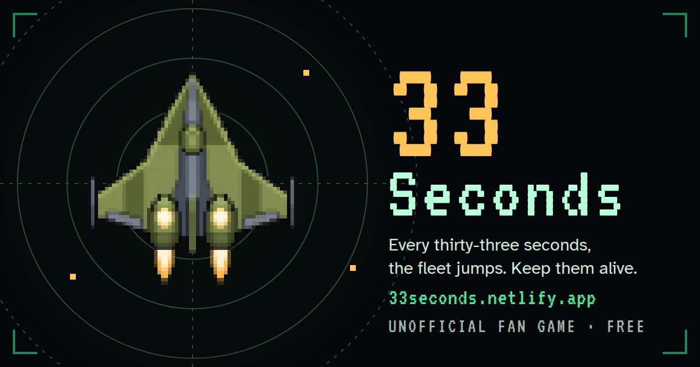
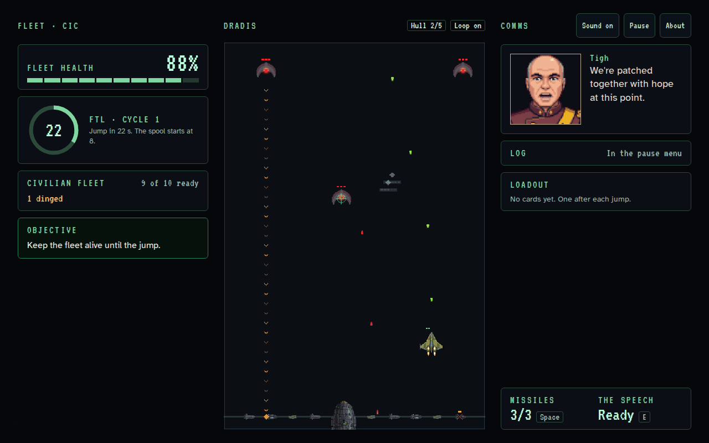
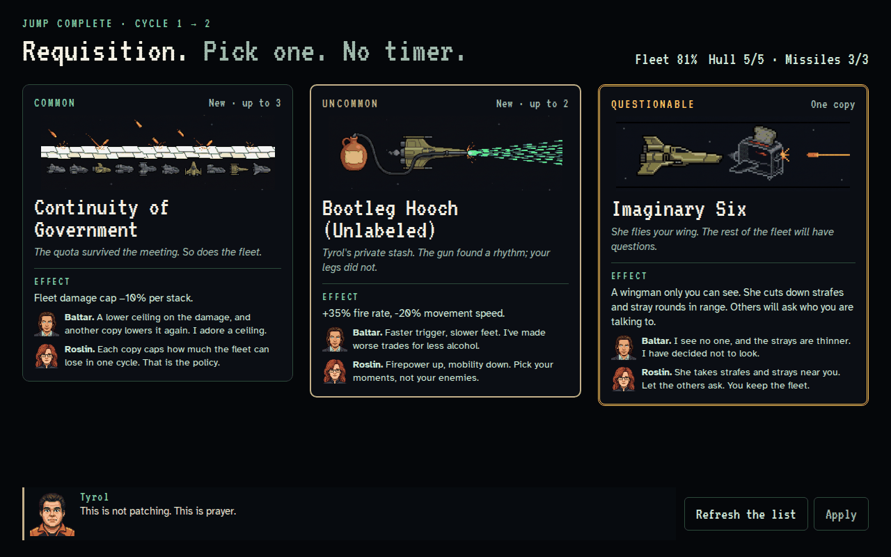
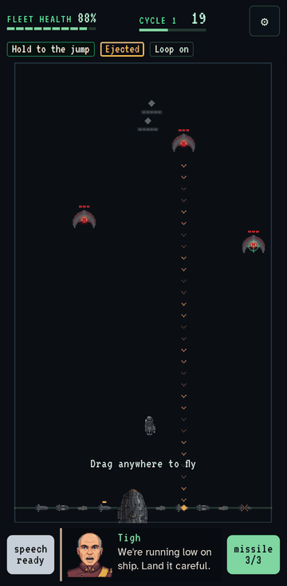
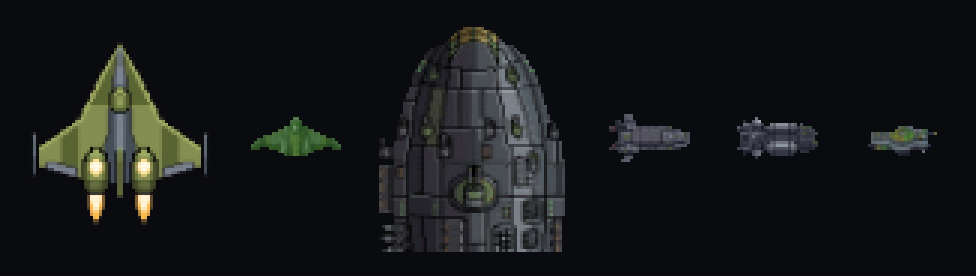
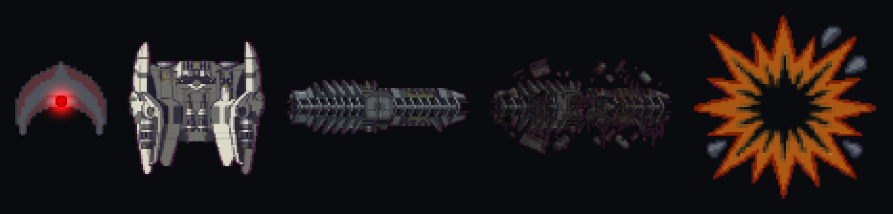

<div align="center">

<a href="https://33seconds.netlify.app/"></a>

# 33 Seconds

**A pixel-art Viper shooter for Battlestar Galactica fans. Plays in your browser, on desktop or phone.**

### [▶ Play it now at 33seconds.netlify.app](https://33seconds.netlify.app/)

[](https://buymeacoffee.com/mooeypoo)
[](https://github.com/mooeypoo/33-seconds/actions/workflows/ci.yml)
[](https://app.netlify.com/projects/33seconds/deploys)
[](LICENSE)

</div>

---

## Playtesters wanted

The game is ready for playtesting. Play a few runs, then tell us what felt fun, unfair, confusing, or
too easy.

- **Played a few runs?** [Send playtest notes](https://github.com/mooeypoo/33-seconds/issues/new?template=2-playtest.yml).
  It's a short form: how hard it felt, whether you knew why you lost, your best and worst moments.
  This helps the most.
- **Found a bug?** [Report a bug](https://github.com/mooeypoo/33-seconds/issues/new?template=1-bug.yml).
  Say what you were doing, what happened, and your device and browser.
- **Have an idea?** [Suggest an idea or a change](https://github.com/mooeypoo/33-seconds/issues/new?template=3-idea.yml),
  such as a new card, a balance tweak, or a joke.
- **Finished a run?** The end screen has a **Share link** button. Add your link to the form so we
  can see the run. A challenge link gives whoever opens it a **Beat this** button.

No GitHub account? Tell us in the community chat instead.

If you enjoy the game, you can [buy me a coffee](https://buymeacoffee.com/mooeypoo). ☕

## The game



You fly a **Viper** protecting a civilian **fleet** along the bottom of the screen. Every
**33 seconds** the fleet jumps away, and you have to keep it alive until it does.

The catch: every Cylon Raider you shoot down **resurrects** a few seconds later. The swarm never
ends until you find the **resurrection ship** and destroy it. Then you clear the last Raiders and
win.

- **Protect the fleet, not just yourself.** You lose only when Fleet Health hits zero. If your Viper
  goes down, you eject and lose time, not the run.
- **Pick an upgrade at every jump.** Choose one of three cards, each with a joke, a real effect, and
  a comment each from Baltar and Roslin. There is no timer on the choice.
- **Missiles and the Speech.** Three missiles per cycle for emergencies. The Speech makes you
  invulnerable for a few seconds.
- **The crew talks to you.** Adama, Roslin, Starbuck, Tigh, Tyrol, and friends keep you company
  over comms.
- **A run takes about 6 to 8 minutes.** Pick **Civilian Run** for an easier fleet or **Viper Pilot**
  for the full fight. New pilots can take a short **Training Run** with Chief Tyrol first.
- **Challenges.** Beside the normal run (**Story mode**) there are challenges that bend it:
  **Swarm** (more Raiders, sooner), **Tyrol overwhelmed** (much less repair at each jump), and
  **Endless** (no resurrection ship, so how many jumps can the fleet hold while Tyrol tires?). A
  **weekly challenge** mixes a new set of rules every Monday, the same for everyone. Every
  challenge result ends with a verdict on how you did, and a shared link lets a friend try to
  beat your score.

<table>
<tr>
<td width="68%"></td>
<td width="32%"></td>
</tr>
<tr>
<td align="center"><sub>Pick one of three cards at every jump.</sub></td>
<td align="center"><sub>Plays one-handed on a phone.</sub></td>
</tr>
</table>

### Controls

| | Keyboard | Phone |
|---|---|---|
| Fly | WASD or the arrow keys | Drag anywhere |
| Fire | Automatic | Automatic |
| Missile | Space | The missile button, or tap with a second finger |
| The Speech | E | The Speech button |
| Pause | Esc or P | The pause button (in Settings) |

The game pauses on its own when you switch tabs.

### Comfort and accessibility

No screen shake, wobble, or flashing. Color is never the only cue. Every sound has a visual
equivalent. The game respects your system's reduced-motion setting and has its own reduced-effects
switch, plus an option for a more readable font.

### The cast





## How it is built

33 Seconds is written in TypeScript, with Vue 3 for the menus and HUD and Phaser 4 for the playfield.
It runs as a static site on Netlify.

The code is split into layers, and **dependencies point one way only**:

```
presentation (Vue)   ─┐
                      ├──►  application (session, pause)  ──►  domain (the game rules)
infrastructure        ─┘
(Phaser, input, audio, storage)
```

The **domain** holds every game rule in plain TypeScript. It imports nothing else, has no clock
and no randomness of its own, and advances in fixed ticks. That makes the rules fully testable
without a browser, and lets headless bots play hundreds of seeded runs to check the balance.
Phaser and Vue only draw what the domain reports. An automated check fails the build if a layer
reaches the wrong way.

Want to look closer, run it locally, or contribute? Read **[DEVELOPERS.md](DEVELOPERS.md)**.

## Privacy

The game collects nothing. There are no accounts, analytics, cookies, third-party scripts or fonts,
and no free-text input. Your browser's local storage keeps only your settings and a few "already
seen" flags, and the game works without it. A shared run link carries the run's result in the part
of the URL that never reaches a server, and it names no one. Challenges, the weekly challenge, and
Beat this work the same way: the week is read from your device's clock, and nothing is sent or
stored. A shared leaderboard is designed but deliberately not built
([ADR-0003](docs/adr/0003-community-server-deferred.md)).

## Credits

Made by **Moriel Schottlender** ([mooeypoo](https://github.com/mooeypoo)).
Website: [moriel.tech](https://moriel.tech) · Blog: [blog.moriel.tech](https://blog.moriel.tech)

Card ideas from playtesters: **Enrica.Manes** (*The Fleet's Water Filter*, *Starbuck's Lucky
Streak*, *Gaius' Lab*). Thank you for playing and for the ideas.

Fonts: [VT323](https://fonts.google.com/specimen/VT323) and
[Atkinson Hyperlegible](https://www.brailleinstitute.org/freefont/), both under the SIL Open Font
License. Sound effects are synthesized with [ZzFX](https://github.com/KilledByAPixel/ZzFX). See
[`assets/PROVENANCE.md`](assets/PROVENANCE.md).

## License

The game is free software under the [GNU General Public License v3.0 or later](LICENSE). You may
play it, study it, share it, and change it. If you share a changed version, it must stay under the
same license, with its source available. The fonts keep their own
[SIL Open Font License](assets/fonts/).

**33 Seconds is a free, unofficial fan project.** It is not affiliated with or endorsed by the
show's rights holders or anyone in the cast. All art, audio, and text are original.
